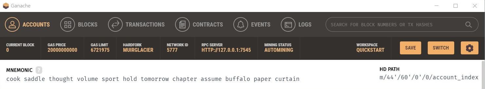

# Truffle pet shop tutorial

[Truffle Tutorial](https://trufflesuite.com/tutorial/)

## Install Truffle

```bash
npm install -g truffle
```
## Compilation

```bash
truffle compile
```

You will see `build/contracts`.

## Migrate

migrate the contract to the blockchain. For tutorial, we are going to use [Ganache](https://trufflesuite.com/ganache/).

```bash
truffle migrate
```

## Test

```bash
truffle test
```


## Running Dapp

```bash
npm run dev
```

Enter the mnemonic that is displayed in Ganache to your wallet. We are going to use [MetaMask](https://metamask.io/).

**Warning**: Do not use this mnemonic on the main Ethereum network (mainnet). If you send ETH to any account generated from this mnemonic, you will lose it all!



